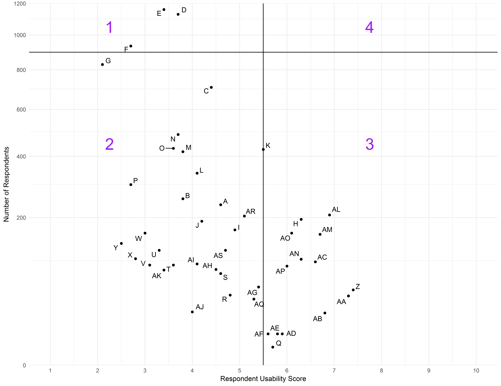

```{r setup, include=FALSE}
# Load required packages
if (!require("pacman")) install.packages("pacman")
pacman::p_load(ggplot2, plotly, crosstalk, flexdashboard)
pacman::p_load_gh("jcheng5/d3scatter")
devtools::install_github('rstudio/DT')
library(DT)

# Get the user's home directory path (Defining this value allows other users to easily run this script)
home <- path.expand("~")

# Determine if computer running this script is on windows, if not, don't change path to backslashes 
if (Sys.info()["sysname"]=="Windows") {
  home <- as.character(gsub("/","\\\\",home))
} else {
  home <- as.character(home)
}

# Set project directory
if (Sys.info()["sysname"]=="Windows") {
  projectdir <- "\\Projects\\Graph Making\\CTRMA Data\\"
  wd <- paste0(home,projectdir)
} else {
  projectdir <- "/Projects/Graph Making/CTRMA Data/"
  wd <- paste0(home,projectdir)
}
setwd(wd)

# Import the data file
datapts <- read.csv(paste0(wd,"ChrisNeedsHelp.csv"), stringsAsFactors = F)

# Rename columns
names(datapts) <- gsub("\\.","",colnames(datapts))
datapts <- datapts[,c(1:2,4:5)]

# Get median values for x & y columns
xmed <- median(datapts$RespondentUsabilityScore)
ymed <- median(datapts$NumberofRespondents)

# Define shared data for use with crosstalk package
sd <- SharedData$new(datapts)

```

Interactive Graph
=======================================================================

Inputs {.sidebar}
-----------------------------------------------------------------------

```{r}
filter_checkbox(id="TouchPoint", label = "Touch Point", sd, group=~TouchPoint, columns = 1)
filter_slider(id="NumberofRespondents", label="Number of Respondents", sd, step=25, column=~NumberofRespondents)
filter_slider(id="RespondentUsabilityScore", label="Respondent Usability Score", sd, step=0.1, column=~RespondentUsabilityScore)
```

---

**Instructions:**

Use the above filters to change what data is highlighted in the graph and the data table. 

You can perform a rectangular selection on the graph to view the corresponding rows in the data table. 

A static version of this graph can be viewed on the [Static Graph] tab in the navigation bar at the top of this page.

---


Row
-------------------------------------

###

```{r}
# Reference: https://rstudio.github.io/crosstalk/index.html
library(d3scatter)
d3scatter(sd, ~RespondentUsabilityScore, ~NumberofRespondents, width="100%", 
          x_label="Respondent Usability Score", y_label="Number of Respondents",
          x_lim=c(1,10),y_lim=c(0,1200))
```

### 

```{r}
library(DT)
datatable(sd, rownames = FALSE, extensions=c("Buttons"),
          colnames=c("Touch Point", "Function", "Respondent Usability Score", "Number of Respondents"),
          options = list(searchHighlight = TRUE, autoWidth = TRUE,
                         columnDefs = list(list(className = 'dt-left', targets = c(0,1)),
                                           list(className = 'dt-center', targets = c(2,3))),
                         dom = "Bfrt",
                         buttons = list("colvis",
                                        list(extend = "collection",
                                             buttons = list(
                                                list(extend = "csv"),
                                                list(extend = "excel"),
                                                list(extend = "pdf",
                                                     orientation = "landscape")),
                                              text = "Download")),
                         pageLength = 50))
                        
```


Static Graph
=========================================================

Row
-------------------------------------

###



References
=========================================================

Row
-------------------------------------

###

**Credits:**

The following packages were used: [flexdashboard](http://rmarkdown.rstudio.com/flexdashboard/),  [d3scatter](https://github.com/jcheng5/d3scatter), [DT](https://cran.r-project.org/web/packages/DT/index.html), [ggplot2](http://ggplot2.org/), [ggrepel](https://cran.r-project.org/web/packages/ggrepel/index.html), [crosstalk](https://rstudio.github.io/crosstalk/index.html)

**References:**

- https://rstudio.github.io/crosstalk/index.html
- https://stackoverflow.com/a/35510338
- https://rstudio-pubs-static.s3.amazonaws.com/215948_95c1ab86ad334d2f82856d9e5ebc16af.html 
